# Introduction
Cameras and lenses have evolved continuously over the last few decades, producing increasingly high-quality images that have helped capture several precious moments for eternity. When photography was at its infancy in the 19th century, every little innovation in optic design resulted a drastic leap in image quality. At a time, when clicking a portrait meant that the subject had to stay still for several seconds or even minutes, a lens that was 'fast' enough to capture sufficient light within a short span of time meant exponential progress. It was around this time that Joseph Petzval came up with his design using aberration theory, which laid the foundation for modern optic design. 

This article presents a DIY optical design project based entirely on off-the-shelf components. The project explores the design and construction of a Petzval-like portrait lens intended to reproduce characteristic rendering effects such as swirly bokeh. Modern photographic lenses are generally designed to minimize optical aberrations and maintain high image quality across the entire field of view. In contrast, the Petzval lens prioritizes a large aperture while leaving certain off-axis aberrations, particularly field curvature and astigmatism, comparatively uncorrected, contributing to its distinctive rendering. 

Inspired by $\textbf{Ronian Siew}$ (https://www.youtube.com/shorts/FY8pygPwD04), the objective of this project is therefore not to outperform a modern prime lens, but to recreate some of this characteristic behaviour using commercially available optical components and open-source optical design tools.

<figure style="text-align:center;">
    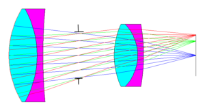
    <figcaption>
        <b>Figure 1.</b> Schematic of the Petzval lens (Image source: https://www.eckop.com/resources/optics/lens-types/camera-lens-types/)
    </figcaption>
</figure>

A few excellent DIY Petzval lens projects have already been published online, including those by Siegfried Weisenburger(https://siegfried-weisenburger.de/2020/06/07/homebuilt-petzval-type-lens-for-dslr/) and CameraMaker(https://cameramaker.se/Petzval_Lens.htm). These projects served as valuable inspiration and demonstrate that it is possible to build characterful photographic lenses from commercially available optical components.

The present project differs in the following aspects. First, the complete optical design workflow is carried out using Optiland, complemented by first-order analytical calculations, making it fully reproducible without requiring commercial optical design software. Second, the mechanical design is intended primarily for modern mirrorless camera systems. Since most major mirrorless mounts (Sony E, Nikon Z, Canon RF and Fujifilm X) have relatively similar flange focal distances (approximately 16–20 mm), the lens can be adapted to different camera systems with only the appropriate mount adapter.

# Optical Design Considerations 
With DIY projects, the challenge comes usually from the large number of constraints one needs to deal with. These typically include the lens selection, availability of mechanical mounts / tubes. Nonetheless, these challenges can be resolved once the requirements are clarified with help of paraxial optics. 

## Selecting the focal-length and f#
A strong background blur is achieved usually by having a very shallow depth of field. This needs a large aperture (f/2.5 or faster), which would require a relatively large entrance pupil. Additionally, the characteristic swirly bokeh arises primarily from strong field curvature and off-axis astigmatism, with residual coma further contributing to the appearance of the peripheral blur. One way to achieve this is by working with shorter focal lengths (eg. 50 mm). The challenge with shorter focal lengths though is aberration control. Spherical aberration becomes hard to manage. Since the flange-focal distance is a fixed quantity, the optical track left for other elements is usually very small for incorporating additional elements such as sliding tubes/ helicoids for focus adjustment. In addition, the shorter focal lengths are less-forgiving to misalignments.

If the effective focal length however is increased to 80-100 mm, then a compromise can be met with the three competing requirements. Moreover, a quick look at the lens catalogs of most vendors also suggests there are plenty of options to choose from to achieve this focal length range. 

To get an initial estimate of the various sizes and distances, we can approximate the lenses to be used as thin lenses. With this in mind, if we take f=90 mm as the desired focal length and f/2.5 as the desired aperture, we can calculate the entrance pupil diameter with the formula $$ F_{number} = \frac{Effective Focal Length}{Entrance Pupil Diameter} $$ to be $\textbf{36 mm}$. 

## Identifying possible lenses 
To have an entrance pupil diameter of 36 mm, the front group must have a clear aperture of at least 40 mm. 2-inch lenses make the perfect choice for this reason, considering their easy availability along with plenty of mounting options.

The Petzval lens system, comprises primarily of two achromats. These achromats could be either air-spaced or cemented. Air-spaced doublets require precise spacing between the elements. Cemented achromats on the other hand are much easier to mount.

Now, to obtain an effective focal length of about 90 mm, a variety of lens combinations could be used. Since the design consists of two positive achromatic groups rather than a telephoto configuration, the total optical track length is expected to be comparable to or greater than the effective focal length. Considering a flange focal distance of 18-20 mm, this would mean about 70 mm space between the two groups.

While this does narrow down the choice of focal lengths for the achromats, it still provides quite a few options.

<figure style="text-align:center;">
    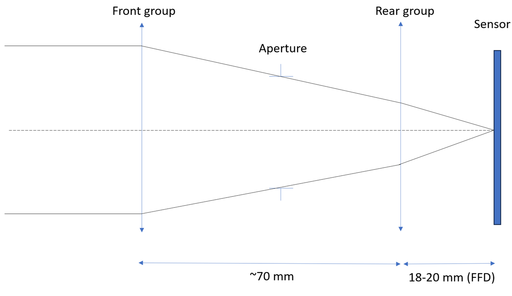
    <figcaption>
        <b>Figure 2.</b> Paraxial layout of the Petzval-inspired lens
    </figcaption>
</figure>

### Choosing the aperture, the front and rear groups

We know that the entrance pupil diameter needs to be at least 36 mm. The aperture stop needs to be in between the two groups. For a simplified mechanical construction, it helps to work with 2-inch (SM2 standard) optomechanics as much as possible. This would mean, an iris aperture from Thorlabs ($\textbf{SM2D25D}$ for example) could be used as the stop. The maximum opening diameter is 25 mm. The pupil magnification is therefore $$ M = \frac{Entrance Pupil Diameter}{Aperture Diameter}\approx 1.44 $$ Using the relation $$ M = \frac{v}{u} $$ where $ v $ and $ u $ are the image and object distances respectively, we get $$ v = 1.44 u $$  Furthermore, using the equation $\frac{1}{v} + \frac{1}{u} = \frac{1}{f}$ (while taking care of the sign-convention), we get $ f \approx 3.27 u$. Assuming the aperture stop is placed roughly in between the two groups, $ u = 35 mm$ and would require the front group to have a focal length of approximately $\textbf{114 mm}$. A quick search through 2-inch achromats in various catalogs shows that an f=100 mm achromat could be a good starting point for the front group. Once again, using the formula to calculate the effective focal length of two thin lenses, $$ \frac{1}{f_{net}} = \frac{1}{f_{1}} + \frac{1}{f_{2}} - \frac{d}{f_{1}f_{2}}  $$ we get the focal length of the rear group to be $f_{2} \approx 270 $ mm. Another quick search of the various catalogues yields two possibilities, namely $f=250$ mm and $f=300$ mm. Although a 250 mm rear achromat gives an effective focal length very close to the 90 mm target, a 300 mm achromat was selected because its lower optical power is expected to introduce smaller aberrations and provides a more forgiving starting point for optimization.

We can hence choose the lenses $\textbf{AC508-100-A}$ and $\textbf{ACT-508-300-A}$ from Thorlabs as the front and rear groups respectively. We choose the achromats with the 'A' coating since we require an anti-reflection coating for the wavelengths between 400 and 700 nm.

## Setting up the Optical Model

The optical system is first modelled in Optiland to establish an initial design and evaluate its imaging performance. Since the objective is to reproduce the behaviour of the physical prototype, the aperture type is set to Float by Stop Size. This allows the physical dimensions of the iris diaphragm to be specified directly, while the corresponding entrance pupil diameter, image-space F-number and working F-number are computed automatically by the software.

To evaluate image coverage across the sensor, the field type is chosen as Real Image Height. Rays are traced both on-axis and at the edge of the image sensor, allowing the effects of field curvature and mechanical vignetting to be assessed. The lens is intended for use with a Sony A6000 camera, which features an APS-C sensor with a diagonal of approximately 28.2 mm. Consequently, a maximum semi-field height of 14.1 mm is used throughout the analysis.

The optical performance is evaluated at the standard Fraunhofer F, d, and C wavelengths (486.1 nm, 587.6 nm and 656.3 nm, respectively), thereby accounting for the chromatic behaviour of the optical system.
The prescriptions of the two achromatic doublets are imported directly from the Zemax lens files supplied by Thorlabs. These are combined to form a single sequential optical system within Optiland. Although the achromats have a mechanical diameter of 2 inches, the clear aperture is typically lesser, when additional elements such as a lockring are also taken into consideration. Generally, 90% of the mechanical diameter is considered a realistic value for the clear aperture. Therefore, in the simulation, we use a semi-diameter of 22.86 mm for the lenses.

The aperture stop is placed between the two lens groups. The physical prototype employs a variable iris diaphragm with a maximum opening of 25 mm; therefore, the stop semi-diameter is specified as 12.5 mm. The initial spacing between the optical groups is obtained from the first-order paraxial analysis presented in the previous section. The thin-lens model predicts a separation of approximately 70 mm between the principal planes of the two achromats. Since each cemented doublet has a physical thickness of approximately 20 mm, and the principal planes are expected to lie close to the geometric centres of the lenses, the initial air gap between the rear surface of the front group and the front surface of the rear group is taken to be approximately 50 mm. This provides a suitable starting point for the subsequent optimization.

Finally, the distance between the rear lens group and the image sensor is initialized to approximately 23 mm, corresponding to the 18 mm flange focal distance of the Sony E mount together with the mechanical adapter used to mount the lens assembly.

### Initial Optical Layout

The initial optical layout is evaluated for an object located at infinity. Figure 3 shows the resulting two-dimensional ray trace generated by Optiland.

<figure style="text-align:center;">
    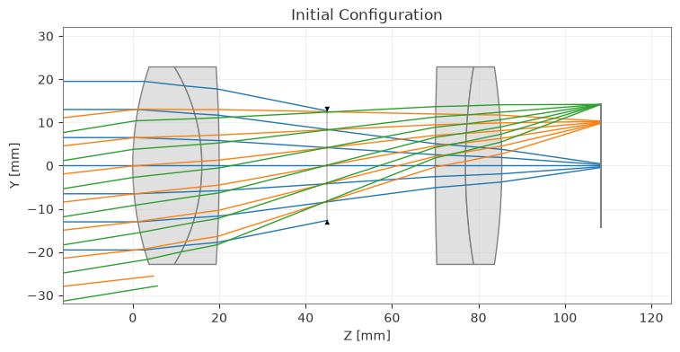
    <figcaption>
        <b>Figure 3.</b> Paraxial layout of Petzval-inspired lens
    </figcaption>
</figure>

Even before optimization, two characteristic features of the design are immediately apparent. First, the off-axis rays experience noticeable clipping, indicating that some degree of mechanical vignetting will be present towards the edges of the image. Second, the paraxial focal points corresponding to the different field heights lie on a strongly curved surface rather than a plane. This pronounced field curvature is a defining characteristic of Petzval-type lens and is one of the principal contributors to the distinctive swirly background rendering observed in the final photographs.

The ray trace also shows that the paraxial focus of the on-axis field lies a few millimetres behind the image plane, indicating that the initial first-order estimate requires refinement before the lens reaches best focus.

### Optimization

To obtain an initial focused configuration, the separation between the two lens groups is optimized by minimizing the RMS spot size for the on-axis field (Hx=0,Hy=0) in all 3 wavelengths. The optimization converges to an approximately symmetric configuration, placing the aperture stop 26.7 mm from both the front and rear lens groups. This optimized spacing serves as the starting point for the subsequent optical analysis.

### Initial Performance Evaluation

The optimized paraxial model predicts an entrance pupil diameter of approximately 39.9 mm, corresponding to an image-space F-number of approximately f/2.3. This is slightly faster than anticipated from the first-order calculations and confirms that the use of 2-inch achromats provides sufficient clear aperture to avoid significant clipping of the marginal rays.

The FFT-based modulation transfer function (MTF) provides further insight into the imaging performance of the system.

<figure style="text-align:center;">
    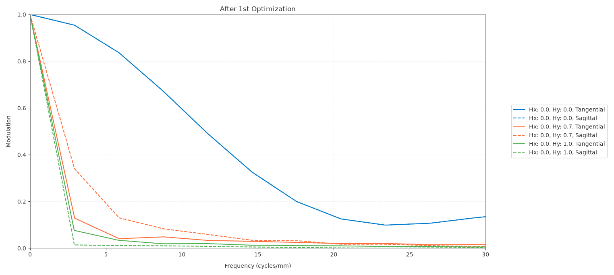
    <figcaption>
        <b>Figure 4.</b> FFT MTF after the 1st optimization
    </figcaption>
</figure>

As expected, the centre of the field exhibits the highest contrast, while the off-axis performance degrades rapidly owing to the combined effects of field curvature, astigmatism and coma. This behaviour is characteristic of classical Petzval portrait lenses, where image quality is intentionally sacrificed away from the optical axis in favour of a distinctive rendering.

The simulated MTF50 of approximately 12 lp/mm indicates that the system provides sufficient resolution for portrait photography, where preserving the overall rendering and background character is often more important than maximizing sharpness across the entire image field.

# Mechanical Design

## Selecting the tubes and adapters

Choosing the lenses and optimizing the distances is only one part of the design. A bigger challenge comes from integrating the lenses using only off-the shelf optomechanical components. It might very well be possible that the distances between the lenses might have to reoptimized, once the mechanical components are chosen. Since the lenses chosen for this design are both 2 inch achromats, the mechanical design will be centered around SM2 tubes. The SM2 iris can also be easily integrated with SM2 tubes. An additional adapter will however be necessary to attach the SM2 tubes on to the Sony-E-Mount. 

For now, there aren't any adapters that can be used to attach an SM2 tube to the E-Mount directly. Most common adapters usually have either the threading for C-mount or M42 on the other end. It is hence necessary to have an additional adapter from SM2 to either C-Mount or M42, followed by another adapter to the E-Mount. We will choose the SM2- M42 adapter, since the M42 standard has a larger opening than C-Mount and minimizes mechanical vignetting. Moreover, there are additional adapters from M42 to Canon, Nikon and Fujifilm mounts as well.

1. The first mechanical components to choose would be the SM2 tubes for the lenses. The inner thread depth of these tubes must be larger than the lenses in order to ensure that the lenses can be mounted securely. The f=300 mm lens has a total thickness of about 15 mm while the f=100 mm lens has a total thickness of 20 mm. We hence choose an SM2 tube with 25.4 mm of usable internal thread (Thorlabs SM2L10), which provides sufficient space for the lockrings and to attach other components.
   
2. Next, we choose the M42-to E-mount adapter. For this, there exists two possibilities. One type of adapters includes a focus adjustment mechanism (for example: K&F CONCEPT M10105 M42-NEX). These are usually 15-20 mm thick and enable moving the entire lens system back and forth while keeping the effective focal length constant. To focus on the sensor in this configuration, a signifcant decrease in the distance between the front and rear groups is necessary. This would mean, that the iris aperture will now be much closer to the front group and thereby resulting in a weaker pupil magnification, which in turn would result in a weaker swirl character. To create the Petzval-ish look in the images, a large entrance pupil is absolutely necessary and hence the distance between the front group and the iris aperture needs to be as large as possible. A trade-off of this would be that the space between the lenses not only needs to accomodate the iris aperture, but also a moving mechanism for focal adjustment. This would mean the effective focal length will vary slightly while adjusting the focus.

4. The other alternative comprises of relatively thin adapters, with one end having an M42-Female thread and the other the E-Mount profile (for example: https://www.amazon.de/dp/B0D458HY8B?ref=ppx_yo2ov_dt_b_fed_asin_title). This adapter is about 1 mm thick and doesn't significantly alter the back-focal distance. An additional adapter with an SM2 internal thread and M42 external thread would be necessary to attach the rear group to the camera body. For this, the Thorlabs SM2A25 adapter can be used. The iris aperture can be very easily positioned in front of the rear group, with the  help of the SM2 threads. The distance from the rear group to the iris aperture is however not 25 mm in this configuration. An additional spacer might be required. This can be chosen, once the spacing between the iris and front group is also finalized.
   
5. To adjust the focus, we need a mechanism. For this purpose, we could choose helicoid adapters for focusing. Helicoid focusing provides a smooth and precise movement of the lenses. They are also readily available online, since they are extremely popular in macro-photography. These come with a variety of travel ranges. The common ones are 12-17 mm, 17-31 mm and 25-55 mm. The helicoid needs to provide sufficient travel range for focussing at infinity and to distances as low as 1.5 m. To estimate the required travel range, the space between the two groups is optimized for the two extremes of object distances. This indicates that we will require at least 9 mm travel. We hence choose the 17-31 mm variant for our use. The thicknesses of the respective M42 to SM2 adapters additionally need to be included to the total distance between the front and rear groups as well.

Putting it all together, we get a layout as shown in the image below.
<figure style="text-align:center;">
    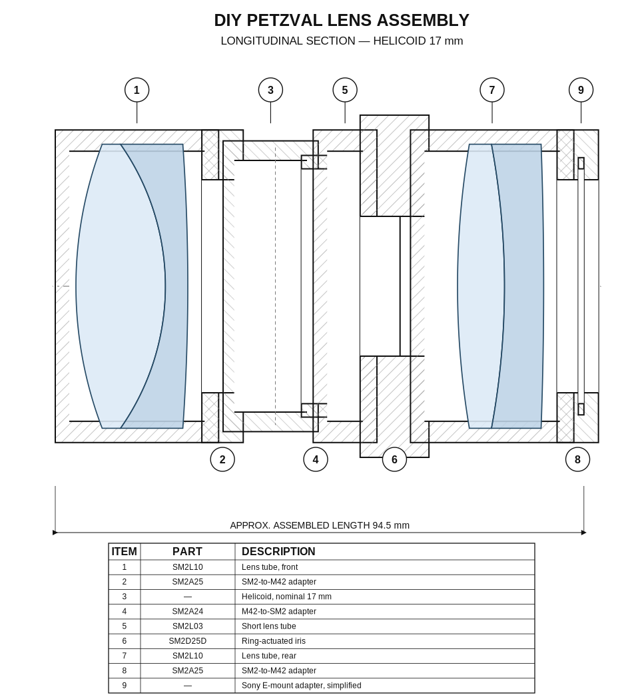
    <figcaption>
        <b>Figure 5.</b> Cross-sectional mechanical layout reconstructed from manufacturer-supplied component drawings and simplified models of the helicoid and camera-mount adapter
    </figcaption>
</figure>

When the adapters along with the helicoid are stacked up, the minimum distance to the iris from the front group is about 37 mm. To preserve the desired effective focal length, the distance from the iris aperture to the rear group needs to be correspondingly reduced. By attaching the iris aperture directly to the SM2L10 tube, this distance is kept at about 14 mm, thereby preserving the originally desired effective focal length.  

The assembled lens, hence looks as follows.

<figure style="text-align:center;">
    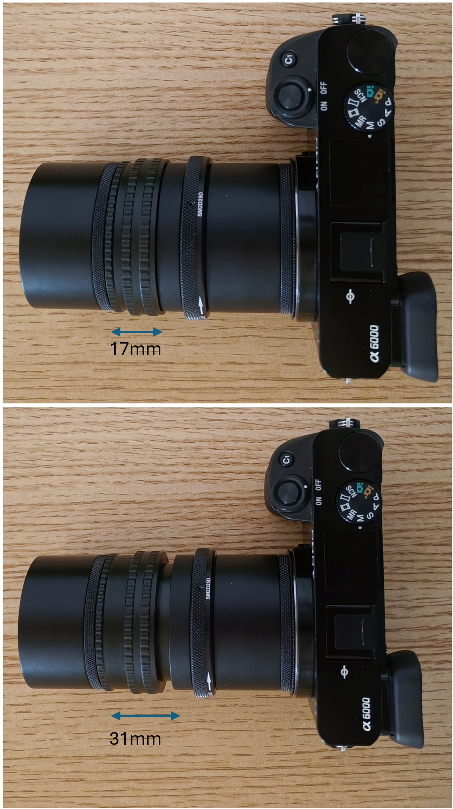
    <figcaption>
        <b>Figure 6.</b> The assembled lens attached to the camera, with the helicoid in a fully-retracted position (above) and fully extended position (below)
    </figcaption>
</figure>

# Evaluation of Optical performance
## Optimization with new distances
Having finalized the mechanical design, the distance between the elements is significantly different from the original design and hence the system needs to be optimized once again. As done earlier, once again only the RMS spot size shall be optimized, for the on-axis field (Hx,Hy = 0) at all wavelengths for an object at infinity. While optimizing, the helicoid travel range is taken as a constraint. The minimum distance from the front group to the iris aperture would hence be 37 mm and the maximum would be 51 mm.

<figure style="text-align:center;">
    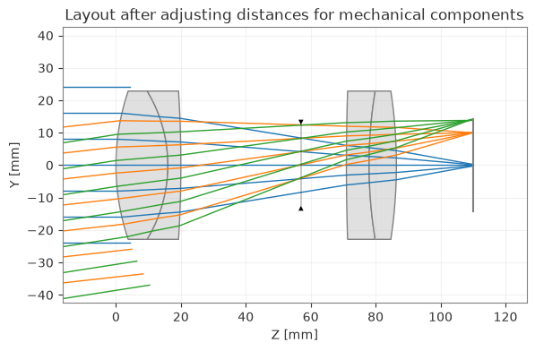
    <figcaption>
        <b>Figure 7.</b> Optical layout after adjusting the distances for mechanical components
    </figcaption>
</figure>

<figure style="text-align:center;">
    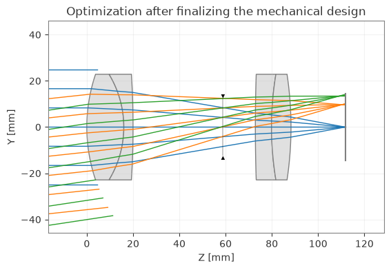
    <figcaption>
        <b>Figure 8.</b> Optical layout after optimization
    </figcaption>
</figure>

The optimal RMS spot size is found when the distance to the iris aperture is ~38.9 mm. The through focus spot-diagram indicates however, that the geometrical radius of the spot diagram is the least at about 38.6 mm. This is also confirmed by looking at the MTF curves while keeping the image plane in these the two positions. The MTF curve for the on-axis field has an MTF50 of about 12 lp/mm and shows almost the same shape as it was when the front and rear groups were placed equidistant from the iris.     
<figure style="text-align:center;">
    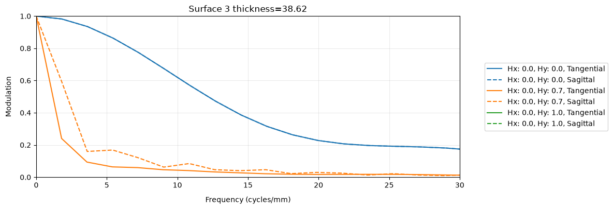
    <figcaption>
        <b>Figure 9.</b> MTF curves at the best focus
    </figcaption>
</figure>

A paraxial analysis of the system however results in an image-space f-number of 1.8 with an entrance pupil diameter of almost approximately 50 mm. In addition, while looking at the ray-tracing diagrams for the system after optimization, it appears as though the front group lens itself might be acting as the limiting aperture, even for the on-axis field.

## Tolerance Analysis

The optical prescription discussed above assumes perfect alignment of the two catalog achromats. In the physical prototype, however, the internal geometry of each cemented doublet is fixed by the manufacturer; the larger uncertainty is expected to come from how the complete front and rear groups sit inside the threaded tubes, adapters and helicoid. The tolerance model therefore concentrates on **group tilt and group decenter**, rather than perturbing the individual refracting surfaces independently.

For the Monte Carlo study, the front and rear achromats are treated as separate mechanically misaligned groups. Within each group, the same tilt and decenter values are assigned to all three refracting surfaces. This is a simplified approximation of a rigid-body displacement: it does not explicitly rotate the complete achromat about a single mechanical pivot, but for the relatively small alignment errors considered here it provides a useful first-order estimate of assembly sensitivity while preserving the actual optical prescription of the cemented lenses.

The perturbations are sampled independently from normal distributions. The rotational tolerance is chosen such that $3\sigma = 1^\circ$, corresponding to $\sigma \approx 0.33^\circ$, while the lateral decenter has $\sigma = 0.05$ mm (and therefore $3\sigma = 0.15$ mm). These values are intentionally conservative for a manually assembled prototype in which the lens groups are seated mechanically but cannot be actively centred or tilted during assembly. The analysis will only be an exploratory assembly-sensitivity study rather than as a formal manufacturing-yield prediction.

For every Monte Carlo realization, three quantities are evaluated at the on-axis field: the RMS spot radius, the magnitude of primary astigmatism, $\sqrt{Z_3^2+Z_5^2}$, and the magnitude of primary coma, $\sqrt{Z_7^2+Z_8^2}$. The paired Zernike coefficients(ANSI Standard) are combined as vector magnitudes so that the result describes the strength of the aberration independently of its orientation. This is particularly useful for randomly tilted and decentered groups, because the sign and orientation of the aberration can change from one realization to another. 

<figure style="text-align:center;">
    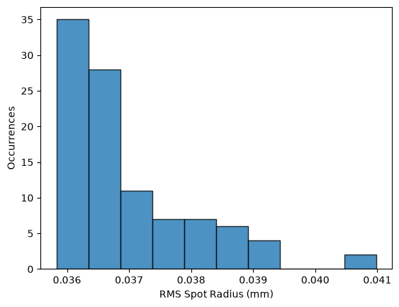
    <figcaption>
        <b>Figure 10.</b> Distribution of the on-axis RMS spot radius for the Monte Carlo assemblies
    </figcaption>
</figure>

The RMS spot-radius distribution broadens as a result of the group misalignments and develops a tail towards poorer realizations. Most random combinations of tilt and decenter create a relatively mild blur, while a smaller number reinforce one another and produce substantially larger blur. Since the image plane is not re-optimized for every realization, part of the RMS increase may also contain a focus contribution in addition to genuinely asymmetric aberrations.

<figure style="text-align:center;">
    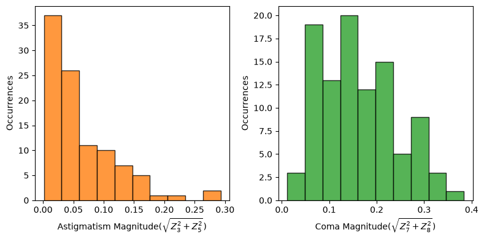
    <figcaption>
        <b>Figure 11.</b> Distribution of the on-axis astigmatism and coma magnitudes
    </figcaption>
</figure>

The astigmatism magnitude remains close to zero for a large fraction of the simulated assemblies, with a relatively long tail corresponding to unfavourable alignment combinations. Coma is generated more readily and occupies a broader range. This could be because decentering and tilting powered lens groups directly break the rotational symmetry of the system and can introduce substantial on-axis coma.

<figure style="text-align:center;">
    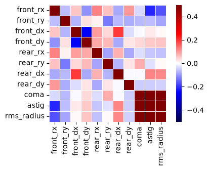
    <figcaption>
        <b>Figure 12.</b> Correlation map between the sampled group misalignments and the resulting aberration metrics
    </figcaption>
</figure>

The sensitivity map indicates that the final performance is not controlled by one single tolerance parameter. Instead, the front- and rear-group errors interact, so a particular tilt or decenter can either reinforce or partially compensate another one. The strongest correlations occur between the optical performance metrics themselves: realizations with increased coma and astigmatism also tend to show a larger RMS spot radius. Overall, looking at the distribution of the RMS spot radius, it is clear that the arrangement will not be very sensitive to tilts and decenters and indicates that the on-axis resolution will remain close to the intended design. 

## Comparison with a Slanted-edge MTF Measurement

To quantify the imaging performance of the lens, the simulated MTF was compared with a simple experimental slanted-edge MTF measurement of the assembled prototype. Since the main design goal is to preserve useful image quality near the optical axis, the test was deliberately restricted to the **on-axis or near-centre field** rather than attempting to map MTF across the full APS-C image. A single high-contrast slanted-edge pattern was printed on one sheet and photographed at an object distance of approximately 3 m. The target was positioned close to the centre of the field and the resulting image was analysed with another open-source program : MTF Mapper (https://sourceforge.net/projects/mtfmapper/). The slight edge tilt allows the edge-spread function to be sampled at a sub-pixel level, from which the corresponding spatial-frequency response can be estimated.

<figure style="text-align:center;">
    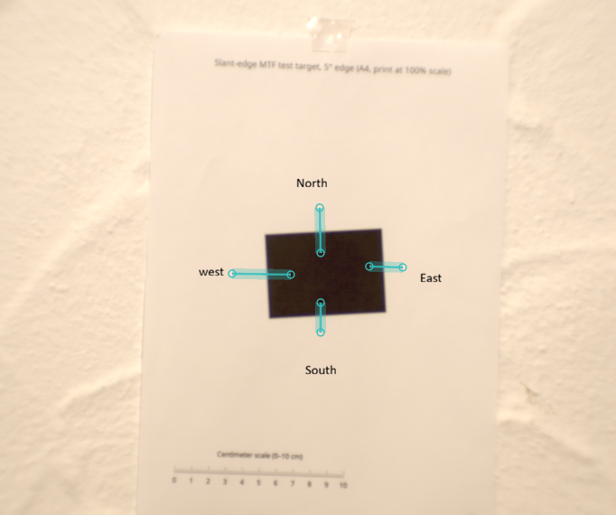
    <figcaption>
        <b>Figure 13.</b> Single-sheet slanted-edge target used for the near-axis MTF measurement
    </figcaption>
</figure>

<figure style="text-align:center;">
    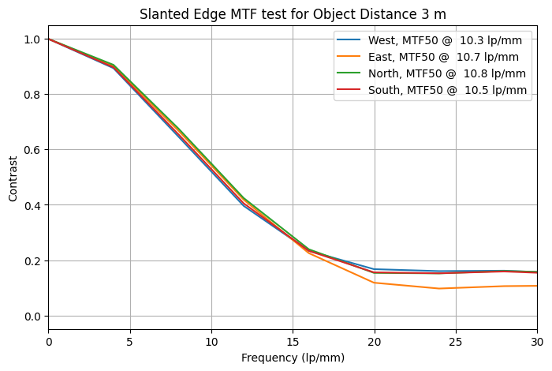
    <figcaption>
        <b>Figure 14.</b> Slanted-edge MTF result obtained with MTF Mapper at an object distance of approximately 3 m
    </figcaption>
</figure>

The measured near-centre MTF50 is about 10.5 lp/mm, compared with approximately 12 lp/mm predicted by the Optiland model near best focus. Considering the simplicity of the experiment, this is a useful level of agreement. The experimental result represents the complete imaging chain rather than the lens alone: printer edge quality, target flatness, focusing accuracy, sensor sampling and image processing, all of which can reduce the measured MTF. Small assembly errors that are absent from the nominal optical model can contribute as well.

The measurement is therefore best interpreted as a **consistency check of the central imaging performance**, rather than as a metrology-grade absolute MTF determination. Within that scope, the measured curve supports the main prediction of the model: the prototype provides useful resolution around the optical axis while deliberately leaving the outer field much less corrected.

# Sample Images, Remarks and Conclusion

The quantitative tests describe only a part of the behaviour of the lens. The purpose of the design is to ultimately have separate the subject from the background very well and in addition provide a unique rendering. The sample photographs below were taken with the assembled prototype at the largest aperture setting. They show that the effect is not simply uniform blur. Near the centre of the frame the rendering is comparatively calm, whereas out-of-focus structures become progressively elongated and directional with increasing field angle. In scenes containing many small flowers or highlights, this produces the characteristic impression of the background rotating around the subject. The swirly bokeh is visible mostly in the cases where the distance between the subject and the background are not significantly large compared to the object distance.

<figure style="text-align:center;">
    
    <figcaption>
        <b>Figure 15.</b> Small flowers with distributed background features, make it easy to spot the swirly Bokeh
    </figcaption>
</figure>

The flower scene is the clearest demonstration of the swirly character. Close to the centre, individual flowers retain a relatively conventional appearance, while towards the borders the out-of-focus flowers and stems become stretched. The gradual change in blur orientation across the field gives the image a rotational impression. Some colour fringing is also visible around high-contrast white flowers, consistent with the residual off-axis chromatic aberration of the simple two-achromat design.

<figure style="text-align:center;">
    
    <figcaption>
        <b>Figure 16.</b> Another example showing strong subject isolation and a smooth transition into the background
    </figcaption>
</figure>

In the close-up plant image, the background contains fewer discrete highlights and the swirl is not visible. Here, the distance between the subject and the background is significantly larger than the object distance, making it very difficult to see any swirl in the bokeh, since the off-axis fields are strongly defocussed. This illustrates an important aspect of the lens: the unusual rendering is strongest when the scene provides sufficient background structure for the field-dependent aberrations to become visible.

<figure style="text-align:center;">
    
    <figcaption>
        <b>Figure 17.</b> An example portrait image, demonstrating useful central sharpness together with a soft, characterful background
    </figcaption>
</figure>
The portrait is a useful counterpoint to the more obvious bokeh examples. The swirling effect is visible albeit with some restraint. The face remains well defined while the foliage behind it is strongly suppressed and gradually develops directional blur towards the image periphery. The aberrations hence contribute to subject separation without overwhelming the portrait. In all the images, the vignetting seems to be moderate and the subjects are well exposed thanks to the large aperture. 

Overall, the prototype behaves as intended. It produces a small region of useful central image quality surrounded by progressively stronger field-dependent aberrations. For portrait and close-up photography this creates strong subject isolation and a recognizable swirly background character, while the large aperture provides substantial light throughput and shallow depth of field. The experimental photographs therefore complement the ray-tracing and MTF results: the same off-axis aberrations that appear undesirable in conventional lens design are responsible for the distinctive rendering sought here.

To conclude, this work demonstrates that Optiland can provide a practical open-source platform for taking an optical design from concept to a functioning imaging system. Using Optiland, the lens was modelled, optimized within real mechanical constraints, evaluated through ray tracing and MTF analysis, and subjected to an assembly-level tolerance study. The subsequent construction of the prototype, experimental MTF measurements and sample photographs demonstrate that the numerical design translates successfully into a usable photographic lens. More broadly, the project highlights how open-source tools such as Optiland can make optical design substantially more accessible to students, researchers and importantly hobbyists without access to specialized commercial optical-design software. The complete Optiland simulation workflow, including the optical model,
optimization, performance analysis and tolerancing, can be found on my GitHub.

Special thanks to $\textbf{Kramer Harrison}$ for all the feedback and exchanges related to Optiland and $\textbf{Christoph Jusko}$ for supporting this project with the Sony A6000 camera.

